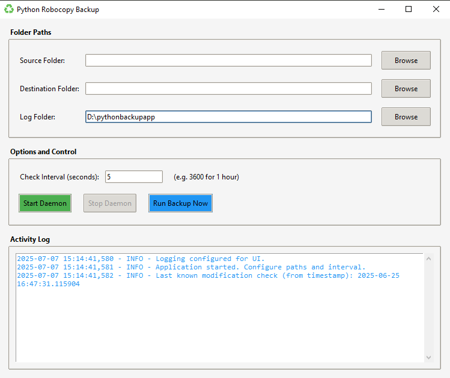

# 🔧 RustyVault v2.0

**Modern Backup Automation for Windows** | Built with Rust + egui

[](https://www.rust-lang.org)
[](https://www.microsoft.com/windows)
[](LICENSE)
[](https://github.com/yourusername/rusty-vault)

> Una aplicación **moderna de backup automático** que combina la **robustez de robocopy** con una **interfaz gráfica intuitiva** desarrollada en Rust.



## 🌟 Features

### 🏗️ **Core Architecture**
- ✅ **Multi-threaded background architecture** with thread-safe configuration
- ✅ **Real-time state tracking** for all backup operations  
- ✅ **Background command system** with mpsc channels
- ✅ **Graceful daemon management** with start/stop controls

### 🎨 **Modern Interface**
- ✅ **Card-based UI** for backup pairs with visual status indicators
- ✅ **Real-time progress dashboard** with color-coded status
- ✅ **Native file dialogs** for easy folder selection
- ✅ **System tray integration** with minimize-to-tray support
- ✅ **Dark mode themes** (Elegant Dark, Forest Green, Steel Blue)

### 📊 **Smart Dashboard**
- ✅ **Segmented progress bar** showing overall backup status
- ✅ **Individual timestamps** per backup pair
- ✅ **Success rate tracking** and execution statistics
- ✅ **Real robocopy data parsing** (files copied, bytes transferred)
- ✅ **Spanish language robocopy support**

### 🤖 **Backup Engine**
- ✅ **Sequential multi-directory backup** with priority ordering
- ✅ **Robust error handling** with retry logic
- ✅ **Manual backup execution** ("Run Backup Now")
- ✅ **Configurable intervals** (minutes, hours, days)
- ✅ **Path validation** with duplicate and circular dependency detection

### 🔄 **Automation & Scheduling**
- ✅ **Background daemon** with configurable intervals
- ✅ **Auto-execution** of all configured backup pairs
- ✅ **Start/Stop daemon** from UI and system tray
- ✅ **Auto-start with application** option

### 🖥️ **System Integration**
- ✅ **Full system tray functionality**
  - Left-click: Context menu
  - Double-click: Restore window
  - Menu: Show App, Start/Stop Daemon, Exit
- ✅ **Native Windows notifications** for backup results
- ✅ **Window hide/restore** with Win32 API integration
- ✅ **Auto-minimize to tray** option

## 🚀 Quick Start

### Prerequisites
- **Windows 10/11** (64-bit)
- **Robocopy** (included with Windows)

### Download & Install
1. Download the latest release from [Releases](https://github.com/yourusername/rusty-vault/releases)
2. Extract `rusty-vault.exe` to your preferred location
3. Place `ico.ico` in the same directory (optional, for window icon)
4. Run `rusty-vault.exe`

### First Time Setup
1. **Add Backup Pairs**: Click "➕ Add Backup Pair" to configure source/destination folders
2. **Set Priorities**: Use ⬆⬇ buttons to reorder backup pairs by priority
3. **Configure Daemon**: Set backup interval (default: 1 hour)
4. **Start Automation**: Click "▶ Start Daemon" to begin automatic backups

## 📋 Usage

### Basic Operations
```bash
# Normal startup
rusty-vault.exe

# Auto-start daemon on launch
rusty-vault.exe --start-daemon

# Show help
rusty-vault.exe --help
```

### Configuration
- **Config File**: `config.json` (auto-created next to executable)
- **Backup Pairs**: Add multiple source → destination folder pairs
- **Intervals**: 1 minute to 24 hours (or custom seconds)
- **Robocopy Options**: Multi-threading, retries, advanced flags

### Backup Priority System
1. **Higher priority pairs run first** in the sequence
2. **Use ⬆⬇ buttons** to reorder priorities
3. **All pairs execute sequentially** to avoid conflicts

## 🔧 Advanced Configuration

### Robocopy Settings
RustyVault uses Windows robocopy with these default options:
- `/MIR` - Mirror mode (sync deletions)
- `/MT:8` - Multi-threaded (8 threads)
- `/R:3` - 3 retry attempts
- `/W:2` - 2 second wait between retries
- `/FFT` - FAT file times compatibility

### Custom Configuration
Edit `config.json` for advanced settings:
```json
{
  "backup_pairs": [
    {
      "id": "unique-id",
      "source": "C:\\Source\\Path",
      "destination": "D:\\Backup\\Path",
      "enabled": true,
      "priority": 1
    }
  ],
  "check_interval_seconds": 3600,
  "robocopy": {
    "multithreading": 8,
    "retry_count": 3,
    "retry_wait": 2
  }
}
```

## 🏗️ Architecture

### Multi-threaded Design
```
┌─────────────────┐    ┌──────────────────┐    ┌─────────────────┐
│   UI Thread     │◄──►│ Background Thread │◄──►│ Robocopy Process│
│                 │    │                  │    │                 │
│ • egui Render   │    │ • Daemon Manager │    │ • File Copying  │
│ • User Input    │    │ • Config Updates │    │ • Progress Data │
│ • Status Display│    │ • State Tracking │    │ • Exit Codes    │
└─────────────────┘    └──────────────────┘    └─────────────────┘
```

### Data Flow
1. **UI Actions** → Background Commands (mpsc channel)
2. **Background Processing** → State Updates (Arc<Mutex>)
3. **Robocopy Execution** → Real-time Progress Parsing
4. **Status Updates** → UI Refresh (60 FPS)

## 🛠️ Development

### Build from Source
```bash
# Clone repository
git clone https://github.com/yourusername/rusty-vault.git
cd rusty-vault

# Build release
cargo build --release

# Run development version
cargo run

# Run with daemon auto-start
cargo run -- --start-daemon
```

### Dependencies
- **eframe/egui** - Modern immediate mode GUI
- **tokio** - Async runtime for background operations
- **serde** - JSON configuration serialization
- **tracing** - Structured logging
- **anyhow** - Error handling
- **tray-icon** - System tray integration

### Project Structure
```
src/
├── main.rs              # Entry point & theme system
├── app.rs               # Main application logic
├── core/
│   ├── backup.rs        # Robocopy execution & parsing
│   ├── config.rs        # Configuration management
│   ├── daemon.rs        # Background daemon logic
│   └── path_validation.rs # Path safety checks
├── ui/
│   ├── main_window.rs   # Main UI components
│   ├── settings_window.rs # Settings panel (WIP)
│   └── components.rs    # Reusable UI components
└── system/
    ├── tray.rs          # System tray integration
    ├── notifications.rs # Windows notifications
    └── process.rs       # Process management
```

## 📸 Screenshots

### Main Dashboard
- **Card-based backup pairs** with individual status
- **Real-time progress bar** with color coding
- **Clean dark theme** with professional aesthetics

### System Tray Integration
- **Minimize to tray** functionality
- **Context menu** with daemon controls
- **Native Windows integration**

## 🔮 Roadmap

### v2.2 - Advanced Dashboard
- [ ] **Detailed statistics** panel
- [ ] **Real-time log viewer** 
- [ ] **Performance metrics** and trending
- [ ] **Smart scheduling** options

### v2.3 - Enterprise Features  
- [ ] **Import/Export** configurations
- [ ] **Advanced exclusion** patterns
- [ ] **Cloud storage** integration
- [ ] **Email notifications**

### v3.0 - Platform Expansion
- [ ] **Cross-platform** support (Linux/macOS)
- [ ] **Web-based** management interface
- [ ] **REST API** for automation
- [ ] **Plugin ecosystem**

## 🐛 Known Issues

- **Drag & Drop Reordering**: Currently blocked by egui limitations (workaround: ⬆⬇ buttons)
- **Settings Window**: Temporarily disabled while implementing proper config binding

## 🤝 Contributing

1. **Fork** the repository
2. **Create** a feature branch (`git checkout -b feature/amazing-feature`)
3. **Commit** your changes (`git commit -m 'Add amazing feature'`)
4. **Push** to the branch (`git push origin feature/amazing-feature`)
5. **Open** a Pull Request

### Development Guidelines
- **Safety First**: Any backup-related feature needs extensive testing
- **User Experience**: Maintain the current polish and intuitive design
- **Performance**: Backup operations should be efficient and non-blocking
- **Compatibility**: Keep robocopy integration excellent

## 📞 Support

- **Issues**: [GitHub Issues](https://github.com/yourusername/rusty-vault/issues)
- **Discussions**: [GitHub Discussions](https://github.com/yourusername/rusty-vault/discussions)
- **Documentation**: [Wiki](https://github.com/yourusername/rusty-vault/wiki)

## 📄 License

This project is licensed under the MIT License - see the [LICENSE](LICENSE) file for details.

## 🙏 Acknowledgments

- **egui community** for the excellent immediate mode GUI framework
- **Microsoft** for robocopy - the robust file copying utility
- **Rust community** for the amazing ecosystem and tooling

---

<div align="center">

**⭐ Star this repo if you find it useful! ⭐**

Made with ❤️ in Rust 🦀

</div>
